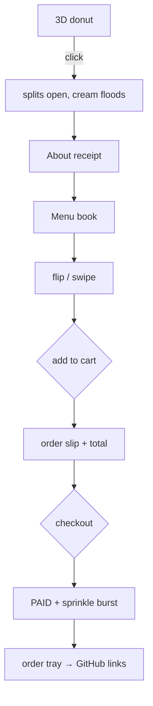
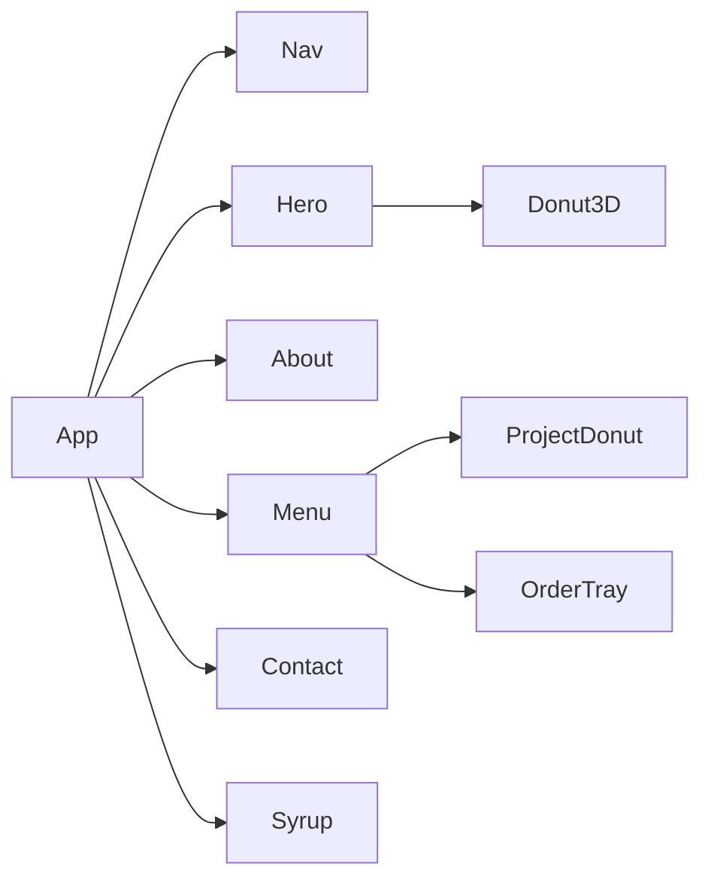

# 🍩 DONUTS & DEVOPS


**Amrit Kang** — full-stack dev · part-time pastry chef · BITS Pilani, 2nd yr.
Single-file React portfolio: 3D donut intro → receipt "about" → projects in a menu book.

---

## Features

| Feature | What it does |
| --- | --- |
| 3D donut intro | Splits open on click, cream floods screen |
| About receipt | Unfurls as a till receipt (photo, facts, totals) |
| Menu book | 3D book, one project per page, CSS page turns |
| Add to cart / checkout | Order slip + running total (18% tax) → PAID stamp + sprinkle burst |
| Order tray | Checked-out projects become GitHub links |
| A11y | Keyboard-nav, ARIA labels, `prefers-reduced-motion` |

## Flow



## Projects

| Project | Tag | Flavor | Stack | Link |
| --- | --- | --- | --- | --- |
| **exHacker** | Autonomous hackathon co-founder | pink | Next.js 15 · React 19 · TS · FastAPI · LangGraph | [repo](https://github.com/amritkang165/ex-hacker) |
| **Pocki** | Your money, simplified | gold | Swift · SwiftUI · iOS | [repo](https://github.com/amritkang165/Pocki) |
| **WearWise** | AI stylist for your closet | mint | React · Node.js · AI APIs · Tailwind | [repo](https://github.com/amritkang165/wearwise) |
| **Gitty** | GitHub, from your pocket | pink | React Native · TS · GitHub API | [repo](https://github.com/amritkang165/gitty) |
| **Study Companion** | One app, every study tool | gold | Next.js · React · Node.js · AI APIs | [repo](https://github.com/amritkang165/studycompanion) |
| **Oratio** | Say it better | mint | React · Node.js · Speech AI | [repo](https://github.com/amritkang165/oratio) |
| **iffy.ai** | Think before you believe | pink | Next.js · React · Node.js · PostgreSQL | [repo](https://github.com/amritkang165/iffy.ai) |

## Architecture



All components + theme (`CSS` string) in `src/Portfolio.jsx`; `main.jsx` is the entry. State: plain hooks, no lib.

## Tech stack

| Layer | Choice | Notes |
| --- | --- | --- |
| Framework | React 19 | function components + hooks |
| 3D | Three.js r172 | procedural geometry, no model files |
| Icons | lucide-react ^0.474 | icons in donut holes |
| Bundler | Vite 6 | `@vitejs/plugin-react` |
| Fonts | Fredoka · Space Grotesk · JetBrains Mono | Google Fonts |

## Implementation notes

| Area | Detail |
| --- | --- |
| Donut | Two `TorusGeometry(1, 0.42)` halves + cream caps, `MeshPhysicalMaterial` w/ clearcoat, 28 sprinkles + 5 drips per half |
| Lighting | Hemisphere + Directional + rim Point |
| Split ease | Exponential smoothing → smoothstep `next²(3−2·next)`; scales 2×, camera dollies in |
| Perf | `min(devicePixelRatio, 2)`; geometry/materials disposed on unmount |
| Page turn | CSS 3D transforms, `backface-visibility: hidden`, 430 ms lockout |
| Swipe | Threshold 55 px |
| Checkout | Guards `count > 0 && !paid`; receipt no. increments |
| Scrollspy | `IntersectionObserver`; `prefers-reduced-motion` via `matchMedia` + CSS |

## Run

```bash
npm install && npm run dev   # http://localhost:5173
npm run build                # dist/
npm run preview
```

## Config — top of `src/Portfolio.jsx`

| Constant | Controls |
| --- | --- |
| `PROJECTS` | `name` · `tag` · `desc` · `stack` · `icon` · `url` · `accent` |
| `MENU_PRICES` | Price per project, in order |
| `ACCENT_COLORS` | pink `#FF8FAB` · gold `#E8A93B` · mint `#8FE3C4` |
| `FACTS` | Receipt fact sheet |
| `PROFILE_IMG` | Base64 portrait |
| `CSS` (bottom) | Full theme |

---

**Contact:** [email](mailto:amritkang2805@icloud.com) · [GitHub](https://github.com/amritkang165) · [LinkedIn](https://www.linkedin.com/in/amritkang28)
