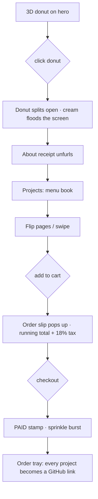
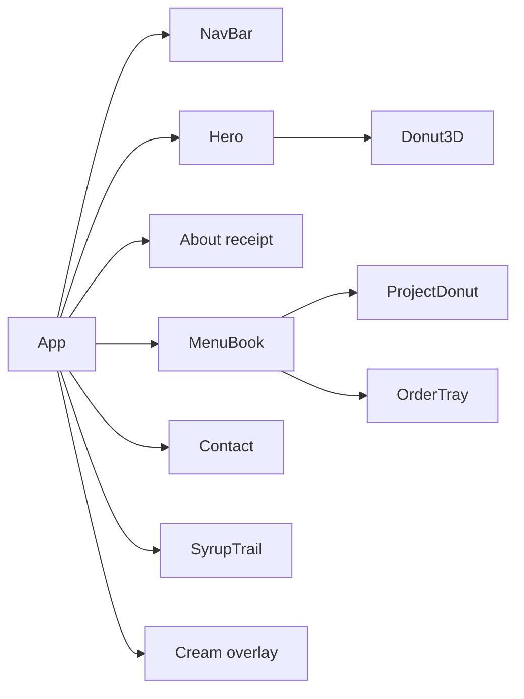

# 🍩 DONUTS & DEVOPS


> **est. 2005 · baked fresh daily** — the portfolio of **Amrit Kang**,
> *full-stack dev · part-time pastry chef* · ID #001 · BITS Pilani · 2nd year

A single-page portfolio built around a bakery metaphor. The hero is a 3D donut
that splits open on click, the about section prints as a shop receipt, and the
projects live in a real 3D menu book you flip through and order from. All of it
runs in one file: `src/Portfolio.jsx`.

---

## 🧾 Highlights

- **3D donut intro** — a Three.js donut (two torus halves) that splits open and grows toward the camera
- **About receipt** — "What's in the box" unfurls as a till receipt with photo, facts and totals
- **Menu book** — a 3D book with hinged cover, one project per page, CSS page-turn animations
- **Add-to-cart + checkout** — order slip with running total (18% tax), PAID stamp, sprinkle burst
- **Order tray** — every checked-out project becomes a clickable GitHub link
- **Accessible** — keyboard-navigable, ARIA-labelled, respects `prefers-reduced-motion`

---

## 🎬 How the site flows



Order it like a donut: **open → read → flip → add → checkout → collect**.

---

## 📖 What's on the menu

| Project | Tag | Flavor | Stack |
| --- | --- | --- | --- |
| **exHacker** | Your autonomous hackathon co-founder | 🍬 pink | Next.js 15 · React 19 · TypeScript · FastAPI · LangGraph |
| **Pocki** | Your money, simplified | 🥐 gold | Swift · SwiftUI · iOS |
| **WearWise** | An AI stylist for your closet | 🍃 mint | React · Node.js · AI APIs · Tailwind |
| **Gitty** | GitHub, from your pocket | 🍬 pink | React Native · TypeScript · GitHub API |
| **Study Companion** | One app, every study tool | 🥐 gold | Next.js · React · Node.js · AI APIs |
| **Oratio** | Say it better | 🍃 mint | React · Node.js · Speech AI |
| **iffy.ai** | Think before you believe | 🍬 pink | Next.js · React · Node.js · PostgreSQL |

Every project is a menu-book page: glazed donut (icon in the hole), tagline,
description, and a live GitHub link after checkout.

---

## 🏗 Architecture



All components and the theme (a single `CSS` template string) live in
`src/Portfolio.jsx`; `src/main.jsx` is just the React entry point. No state
library — plain `useState` / `useRef` / `useEffect`.

### 🍩 The 3D donut (`Donut3D`)

- Built from **two `TorusGeometry(1, 0.42)` halves** with cream caps so the cut faces show when it opens.
- `MeshPhysicalMaterial` with **clearcoat** for the icing sheen; 28 random sprinkles and 5 icing drips per half.
- Lit with **Hemisphere + Directional + rim Point** lights.
- `render()` loop chases a `split` target through an **exponential smoothing** then a **smoothstep ease** (`next²(3−2·next)`); halves pull apart, the donut scales up 2×, the camera dollies in.
- Pixel ratio capped at `min(devicePixelRatio, 2)`; geometry/materials **disposed on unmount**.

### 📖 The menu book (`MenuBook`)

- Cover hinges open via **CSS 3D transforms + `backface-visibility: hidden`**.
- Page turns are gated by a **430 ms lockout**; swipe detection fires past a **55 px threshold**.
- Cart is an array indexed by project; checkout guards on `count > 0 && !paid`, then increments the receipt number and stamps **PAID**.
- Receipt timestamps use `toLocaleDateString`/`toLocaleTimeString`.

### ⚡ Rendering & performance

- Single `requestAnimationFrame` loop for the 3D donut; the **syrup trail** and cream overlays run on the 2D canvas and CSS keyframes respectively.
- `prefers-reduced-motion` disables the animated overlays (`window.matchMedia` guard + CSS).
- `IntersectionObserver` drives the section scrollspy in the navbar.

### ♿ Accessibility

- `role="button"`, `tabIndex` and Enter/Space handlers on the donut, cover, and order items.
- ARIA labels throughout (`Open the donut`, `Open the menu book`, `Add X to order`, etc.).
- Decorative elements hidden with `aria-hidden`; decorative images are `alt=""` / `aria-hidden`.

---

## 🥣 Tech stack

| Layer | Choice | Notes |
| --- | --- | --- |
| Framework | [React 19](https://react.dev) | function components + hooks |
| 3D | [Three.js r172](https://threejs.org) | procedural geometry, no model files |
| Icons | [lucide-react ^0.474](https://lucide.dev) | project icons in the donut holes |
| Bundler | [Vite 6](https://vitejs.dev) | `@vitejs/plugin-react` |
| Fonts | Fredoka · Space Grotesk · JetBrains Mono | Google Fonts import in the CSS |

---

## 🏃 Run it locally

```bash
npm install   # mix the dry ingredients
npm run dev   # http://localhost:5173
npm run build # production bundle → dist/
npm run preview
```

| Script | What it does |
| --- | --- |
| `npm run dev` | Vite dev server with HMR |
| `npm run build` | Production build |
| `npm run preview` | Preview the built output |

---

## 🧑‍🍳 Change the menu

Everything is config at the top of `src/Portfolio.jsx`:

| Constant | Controls |
| --- | --- |
| `PROJECTS` | The 7 menu entries: `name`, `tag`, `desc`, `stack`, `icon`, `url`, `accent` |
| `MENU_PRICES` | Price per project, in project order |
| `ACCENT_COLORS` | `pink #FF8FAB` · `gold #E8A93B` · `mint #8FE3C4` |
| `FACTS` | The receipt fact sheet (flavor / bake time / sprinkles / …) |
| `PROFILE_IMG` | Base64 portrait on the receipt |
| `CSS` (bottom) | The entire theme — colors, fonts, animations |

---

## 📬 Where to find me

- **Email** — [amritkang2805@icloud.com](mailto:amritkang2805@icloud.com)
- **GitHub** — [github.com/amritkang165](https://github.com/amritkang165)
- **LinkedIn** — [linkedin.com/in/amritkang28](https://www.linkedin.com/in/amritkang28)

*Build. Break. Learn. Repeat.*
